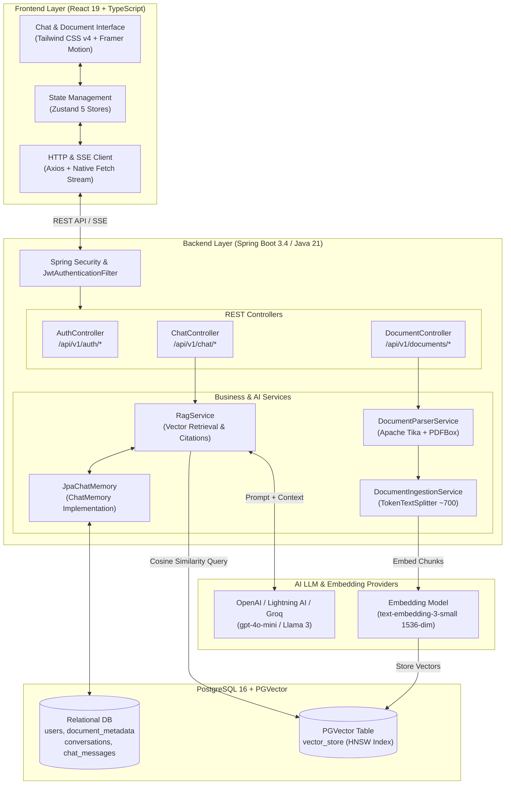
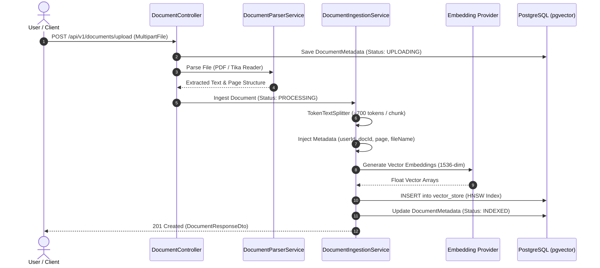
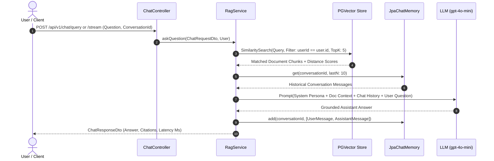
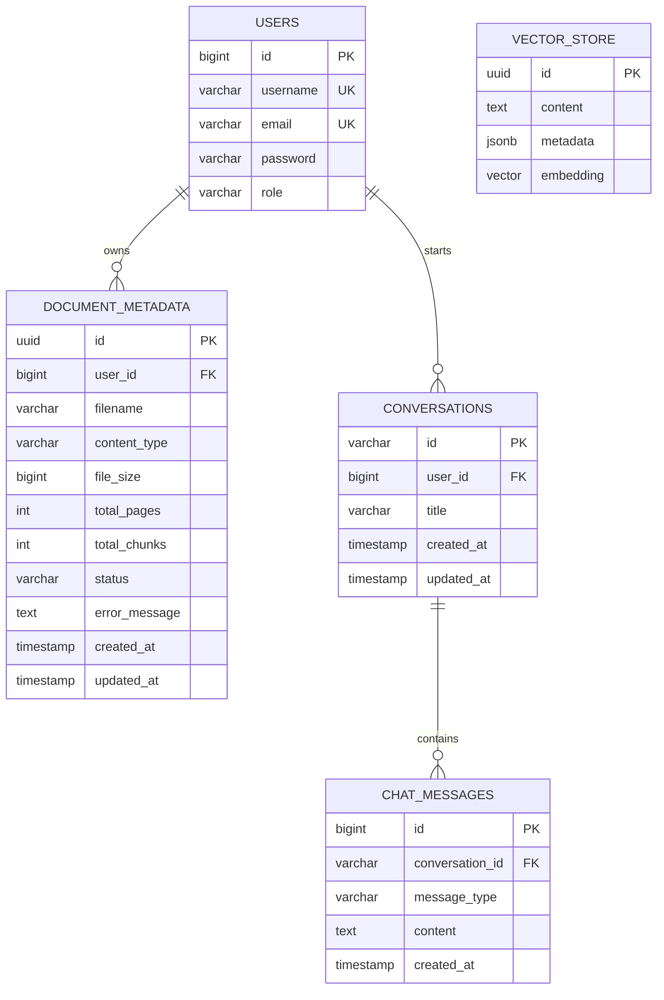

# Versē — Enterprise AI Document Intelligence & RAG Platform

<p align="center">
  
  
  
  
  
  
  
  
</p>

---

**Versē** is an enterprise-grade AI Document Intelligence and Retrieval-Augmented Generation (RAG) platform. It allows users to upload complex, multi-format documents (PDF, DOCX, TXT, MD, CSV), automatically extracts and indexes text into high-dimensional vector embeddings, and provides conversational AI querying grounded in document context with strict multi-tenant isolation, real-time token streaming, and citation tracking.

---

## 🚀 Key Features & Highlights

- 📄 **Multi-Format Ingestion Pipeline**: Automated text extraction across PDF, DOCX, TXT, MD, and CSV files using Apache Tika and Spring AI PDF Page Document Readers.
- 🧩 **Sliding-Window Token Chunking**: Configurable token-based chunking (~700 tokens per chunk) with metadata preservation (file name, page number, chunk index, user ID).
- 🔒 **Multi-Tenant Strict Isolation**: User documents, conversations, and vector embeddings are cryptographically bound to authenticated user accounts (`userId`). Vector similarity searches filter embeddings at the database layer to strictly prevent cross-tenant data leakage.
- ⚡ **High-Speed Vector Search (PGVector + HNSW)**: Powered by PostgreSQL 16 `pgvector` extension with Cosine similarity distance metric and HNSW indexing for sub-100ms vector lookups.
- 💬 **Conversational RAG with Database Memory**: Persistent multi-turn chat history backed by PostgreSQL (`JpaChatMemory`) integrated into Spring AI `ChatClient`.
- 🌊 **Real-Time Token Streaming (SSE)**: Word-by-word Server-Sent Events token streaming reducing Time-to-First-Token (TTFT).
- 📌 **Exact Source Citations**: Every answer provides clickable source citations with exact page numbers, snippet text, and cosine similarity scores.
- 🛡️ **Stateless JWT Security**: Role-based access control (`ROLE_USER`, `ROLE_ADMIN`) with BCrypt password hashing and token expiration.

---

## 🏛️ System Architecture



---

## 🔄 End-to-End Processing Workflows

### 1. Document Ingestion & Indexing Pipeline



---

### 2. Conversational RAG Query & Chat Memory Flow



---

## 🗄️ Database Schema & Data Models



---

## 📡 REST API Reference

### 🔐 Authentication (`/api/v1/auth`)

| Method | Endpoint | Access | Description |
| :--- | :--- | :--- | :--- |
| `POST` | `/api/v1/auth/register` | Public | Register a new user account |
| `POST` | `/api/v1/auth/login` | Public | Authenticate user & receive JWT Bearer token |

### 📄 Document Operations (`/api/v1/documents`)

| Method | Endpoint | Access | Description |
| :--- | :--- | :--- | :--- |
| `POST` | `/api/v1/documents/upload` | Auth (User) | Upload & index a single file |
| `POST` | `/api/v1/documents/upload-multiple` | Auth (User) | Batch upload & index multiple files |
| `GET` | `/api/v1/documents/user` | Auth (User) | Retrieve list of documents uploaded by current user |
| `GET` | `/api/v1/documents/{id}` | Auth (User) | Retrieve single document metadata by UUID |
| `DELETE`| `/api/v1/documents/{id}` | Auth (User) | Delete document metadata & purge vector embeddings |
| `GET` | `/api/v1/documents` | Auth (Admin) | List all documents across all users |

### 💬 RAG Chat & Search (`/api/v1/chat`)

| Method | Endpoint | Access | Description |
| :--- | :--- | :--- | :--- |
| `POST` | `/api/v1/chat/query` | Auth (User) | Send question and receive grounded answer with citations |
| `POST` | `/api/v1/chat/stream` | Auth (User) | Real-time Server-Sent Events (SSE) token stream |
| `POST` | `/api/v1/chat/search/similarity`| Auth (User) | Direct semantic vector similarity search over chunks |

---

## 🛠️ Local Development Quickstart

### Prerequisites
- **Java 21** (JDK 21+)
- **Node.js** (v18+) & **npm**
- **Docker** & **Docker Compose**
- **OpenAI API Key** (or compatible provider like Lightning AI / Groq)

---

### Step 1: Start PostgreSQL + PGVector
Launch the containerized database:

```bash
docker compose up -d
```
*Database will run on port `5434` with user `postgres`, password `postgres`, and database `verse_db`.*

---

### Step 2: Configure & Run Backend
Set your OpenAI / LLM API key and start the Spring Boot application:

```bash
# On Linux/macOS
export OPENAI_API_KEY="your-openai-api-key"
./mvnw spring-boot:run

# On Windows (PowerShell)
$env:OPENAI_API_KEY="your-openai-api-key"
.\mvnw.cmd spring-boot:run
```

*Backend server will start on `http://localhost:8081`.*
*Swagger OpenAPI Documentation: `http://localhost:8081/swagger-ui/index.html`.*

---

### Step 3: Run Frontend UI
Navigate to the frontend directory and start the Vite development server:

```bash
cd frontend/docmind-frontend
npm install
npm run dev
```

*Access the Versē Web UI at `http://localhost:5173`.*

---

## ☁️ Cloud Deployment Guide

### 1. Supabase (PostgreSQL + PGVector)
1. Create a project at [supabase.com](https://supabase.com).
2. Navigate to **SQL Editor** and run:
   ```sql
   CREATE EXTENSION IF NOT EXISTS vector;
   CREATE EXTENSION IF NOT EXISTS "uuid-ossp";
   ```
3. Copy your database host (`db.xxxx.supabase.co`) and connection credentials.

### 2. Railway (Spring Boot Backend)
1. Connect your GitHub repository to [Railway.app](https://railway.app).
2. Set Environment Variables in Railway Dashboard:
   - `SPRING_PROFILES_ACTIVE` = `prod`
   - `DB_HOST` = `db.xxxx.supabase.co`
   - `DB_PORT` = `5432`
   - `DB_NAME` = `postgres`
   - `DB_USER` = `postgres`
   - `DB_PASSWORD` = `<your-supabase-db-password>`
   - `OPENAI_API_KEY` = `<your-api-key>`
   - `JWT_SECRET` = `<your-secure-jwt-secret>`
   - `ALLOWED_ORIGINS` = `https://<your-vercel-frontend-url>.vercel.app`

### 3. Vercel (React Frontend)
1. Import repository into [Vercel](https://vercel.com) with root directory set to `frontend/docmind-frontend`.
2. Add Environment Variable:
   - `VITE_API_BASE_URL` = `https://<your-railway-backend-url>.railway.app`
3. Click **Deploy**.

---

## 📄 License & Attribution

This project is licensed under the **MIT License**. Built with Java 21, Spring Boot, Spring AI, PostgreSQL PGVector, and React.
